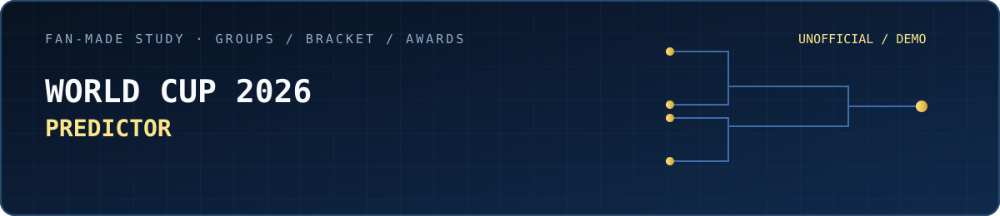
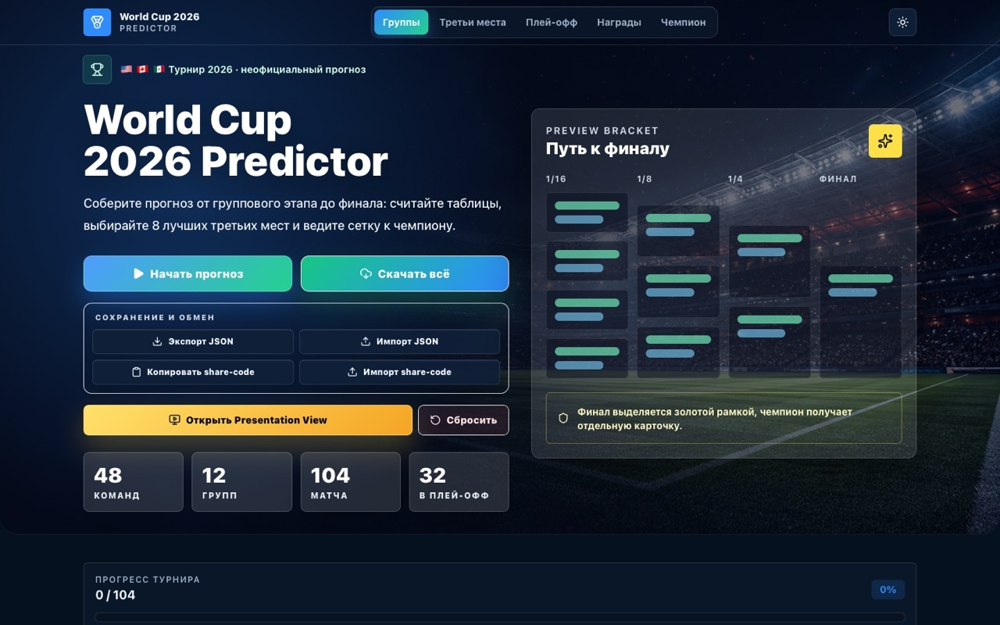
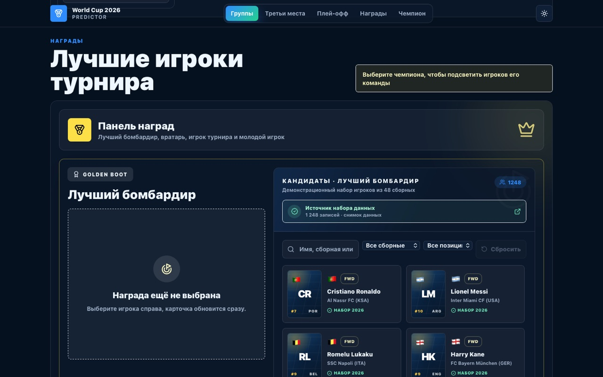
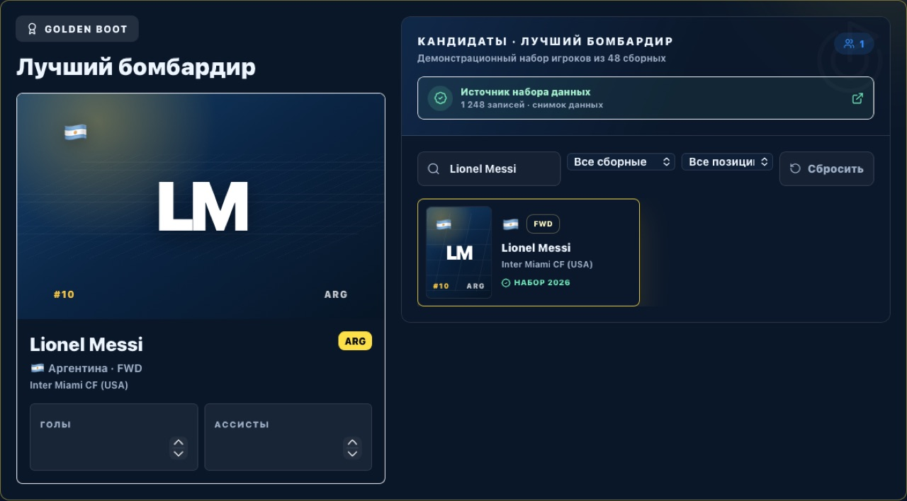
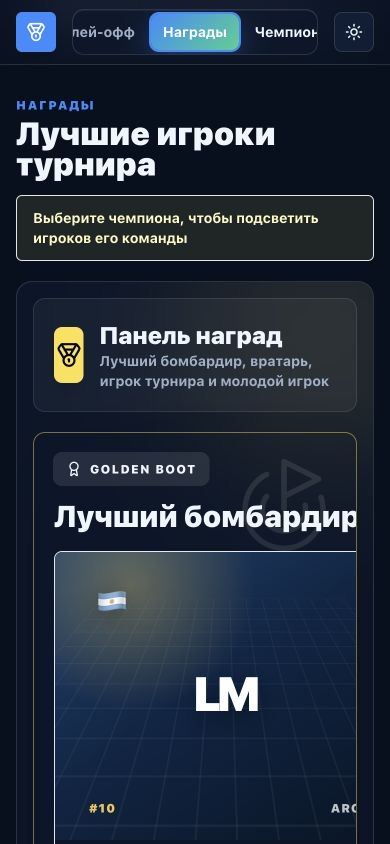

  

  <strong>Русский</strong> · <a href="./README_EN.md">English</a> · <a href="https://github.com/mrjakeball/portfolio">Все проекты</a>

# World Cup 2026 Predictor

Клиентский конструктор турнирного прогноза: пользователь проходит путь от группового этапа до плей-офф, индивидуальных наград и итогового экспорта.

> Неофициальный fan-made проект без связи, партнёрства или одобрения FIFA и организаторов турнира. Все данные на экранах демонстрационные.

| Матч-центр | Детали |
|---|---|
| Формат | Интерактивный конструктор прогноза |
| Состояние | В разработке; публичной версии пока нет |
| Технологии | `React 19` `TypeScript` `Vite` `Zustand` `Vitest` |
| Исходники | Приватны; этот репозиторий содержит только витрину |

  
  

  

  

## Сценарий прогноза

Группы, лучшие третьи места, сетка плей-офф и награды складываются в единый последовательный маршрут, который можно сохранить и продолжить позже.

## Турнирная логика

- выбор результатов группового этапа;
- расчёт проходящих команд и сетки;
- поиск игроков для демонстрационных наград;
- локальные сохранения, экспорт и share-code.

## Состояние и проверки

Zustand управляет связанным состоянием интерфейса, миграции поддерживают старые сохранения, а тесты проверяют ключевые правила перехода между этапами.

  <a href="https://github.com/mrjakeball/portfolio">← Вернуться к списку проектов</a>

